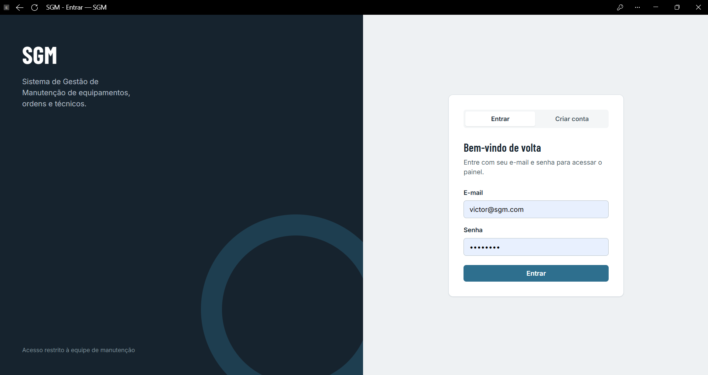
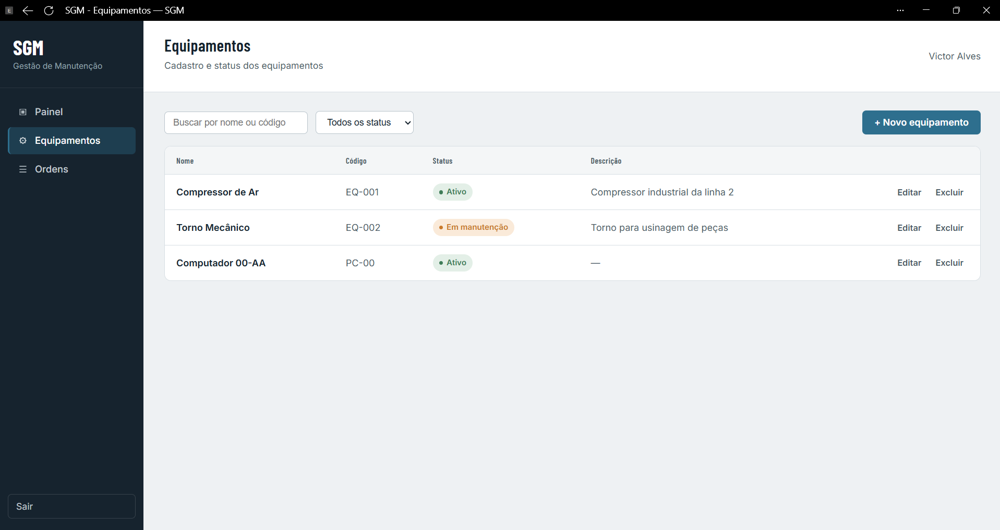
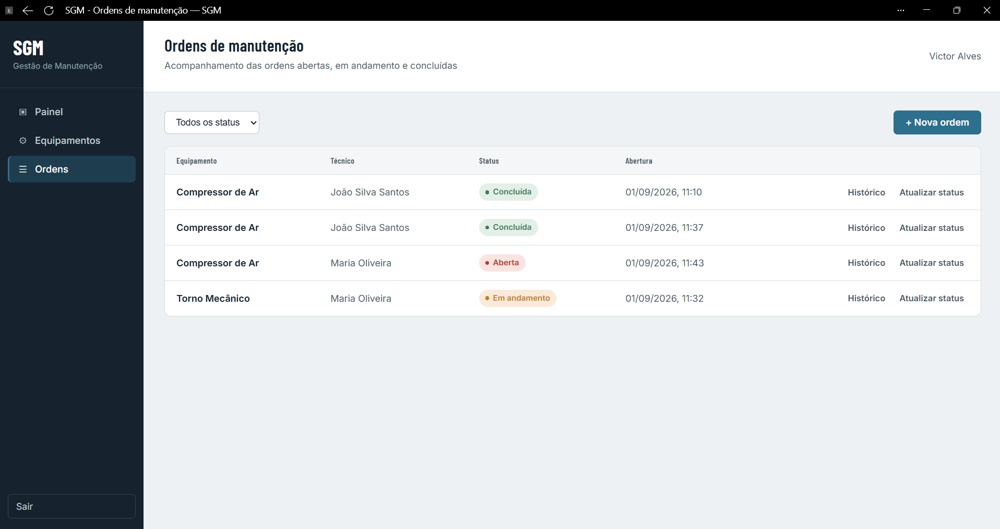
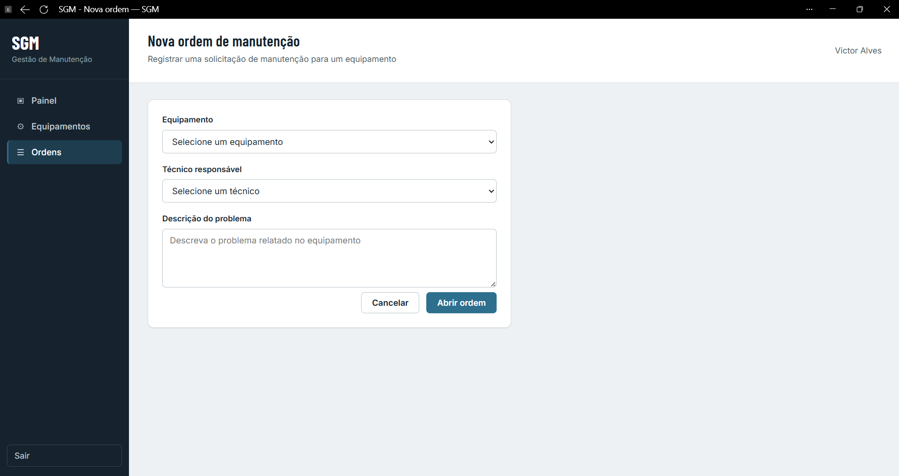

# Sistema de Gestão de Manutenção | S.G.M

Sistema para controle de ordens de manutenção de equipamentos industriais, permitindo o cadastro de equipamentos, técnicos responsáveis e o acompanhamento do ciclo de vida de cada ordem de manutenção (aberta, em andamento e concluída).

## 📋 Sobre o Projeto

O objetivo do sistema é resolver um problema comum em ambientes industriais: a falta de controle centralizado sobre o estado dos equipamentos e o histórico de manutenções realizadas. Com essa aplicação, é possível:

- Cadastrar e consultar equipamentos
- Cadastrar técnicos responsáveis pelas manutenções
- Abrir, acompanhar e encerrar ordens de manutenção
- Consultar o histórico de status de cada ordem
- Garantir que um equipamento não tenha mais de uma ordem de manutenção aberta simultaneamente

## 🚀 Tecnologias Utilizadas

**Back-end**
- Java 17
- Spring Boot
- Spring Data JPA
- Spring Security + JWT (autenticação)
- Bean Validation

**Banco de Dados**
- PostgreSQL

**Documentação de API**
- Swagger / springdoc-openapi

**Front-end**
- HTML5
- CSS3
- JavaScript (Fetch API)

**Testes**
- JUnit 5
- Mockito

**Outras Ferramentas**
- Git / GitHub (versionamento)
- DBeaver (administração do banco)
- Postman (testes de API)
- Trello (gestão ágil das tarefas)

## 🗂️ Modelagem do Banco de Dados

O sistema é composto pelas seguintes entidades principais:

- **Equipamento**: dados do equipamento e seu status atual
- **Técnico**: responsável pela execução das manutenções
- **Ordem de Manutenção**: registro de uma solicitação de manutenção, vinculada a um equipamento e a um técnico
- **Histórico de Status**: registro de cada mudança de status ocorrida em uma ordem de manutenção

> O diagrama entidade-relacionamento (DER) completo e as demais decisões de arquitetura estão documentados em [`sgm/docs/arquitetura.md`](sgm/docs/arquitetura.md).

## 🔧 Funcionalidades

- [x] CRUD de Equipamentos
- [x] CRUD de Técnicos
- [x] Abertura de Ordens de Manutenção
- [x] Transição de status (Aberta → Em andamento → Concluída)
- [x] Bloqueio de múltiplas ordens abertas para o mesmo equipamento
- [x] Histórico de mudanças de status
- [x] Autenticação via JWT
- [x] Documentação automática dos endpoints via Swagger
- [x] Front-end integrado (listagem de equipamentos, abertura/encerramento de ordens)
- [x] Testes unitários das principais regras de negócio (JUnit 5 + Mockito)

## ▶️ Como Executar o Projeto

### Pré-requisitos
- JDK 17 ou superior
- PostgreSQL instalado e em execução
- Não é necessário ter o Maven instalado — o projeto já inclui o Maven Wrapper (`mvnw` / `mvnw.cmd`)

### Passos

```bash
# Clone o repositório
git clone https://github.com/seu-usuario/nome-do-repositorio.git

# Acesse a pasta do back-end
cd SGM/sgm

# Crie o banco de dados no PostgreSQL
# (o nome usado por padrão é sgm_db, veja/ajuste em src/main/resources/application.properties)

# Ajuste em application.properties as credenciais do seu PostgreSQL:
# spring.datasource.url=jdbc:postgresql://localhost:5432/sgm_db
# spring.datasource.username=SEU_USUARIO
# spring.datasource.password=SUA_SENHA

# Execute a aplicação
# Linux/macOS:
./mvnw spring-boot:run
# Windows (PowerShell/cmd):
.\mvnw.cmd spring-boot:run
```

A aplicação estará disponível em `http://localhost:8080`.

> ⚠️ As tabelas são criadas/atualizadas automaticamente pelo Hibernate (`spring.jpa.hibernate.ddl-auto=update`), então não é preciso rodar nenhum script SQL manualmente — só ter o banco `sgm_db` criado e vazio.

### Documentação da API (Swagger)

Com a aplicação em execução, a documentação interativa de todos os endpoints está disponível em:

```
http://localhost:8080/swagger-ui/index.html
```

Por ali dá para testar diretamente os endpoints de `/auth`, `/equipamentos`, `/tecnicos` e `/ordens` sem precisar do Postman — basta se cadastrar/logar em `/auth`, copiar o token JWT retornado e colar no botão **Authorize** da página.

### Executando os testes

```bash
# Linux/macOS
./mvnw test

# Windows
.\mvnw.cmd test
```

Atualmente o projeto conta com **6 testes unitários** (JUnit 5 + Mockito), focados na camada `Service`, onde vive a lógica de negócio:

| Teste | O que valida |
|---|---|
| `abrir_deveLancarRegraNegocioException_quandoJaExisteOrdemAbertaParaOEquipamento` | Bloqueio de ordem duplicada — a regra mais crítica do sistema |
| `abrir_deveCriarOrdemComSucesso_quandoNaoHaOrdemAbertaParaOEquipamento` | Fluxo feliz de abertura de ordem |
| `atualizarStatus_devePreencherDataConclusao_quandoNovoStatusForConcluida` | `dataConclusao` é preenchida automaticamente ao concluir a ordem |
| `buscarPorId_deveLancarRecursoNaoEncontradoException_quandoEquipamentoNaoExiste` | Busca de equipamento inexistente lança `RecursoNaoEncontradoException` |
| `login_deveLancarRegraNegocioException_quandoSenhaEstiverIncorreta` | Login com senha incorreta é rejeitado |
| `cadastrar_deveLancarRegraNegocioException_quandoEmailJaCadastrado` | Cadastro com e-mail duplicado lança `RegraNegocioException` |

## 🖥️ Front-end

O front-end é uma interface simples em HTML, CSS e JavaScript puro, servida diretamente pelo próprio Spring Boot a partir de `sgm/src/main/resources/static/` — não é um projeto separado, então basta a aplicação estar rodando (`./mvnw spring-boot:run`) e acessar `http://localhost:8080` no navegador.

Telas disponíveis:

| Tela | Arquivo | URL |
|---|---|---|
| Login | `login.html` | `http://localhost:8080/login.html` |
| Dashboard | `dashboard.html` | `http://localhost:8080/dashboard.html` |
| Listagem de equipamentos | `equipamentos.html` | `http://localhost:8080/equipamentos.html` |
| Listagem de ordens de manutenção | `ordens.html` | `http://localhost:8080/ordens.html` |
| Abertura/edição de ordem | `ordem-form.html` | `http://localhost:8080/ordem-form.html` |

A comunicação com a API é feita via `fetch` (ver `static/js/api.js` e `static/js/auth.js`), incluindo o envio do token JWT no header `Authorization` após o login.

### Capturas de tela

<!--
Adicione os prints das telas em sgm/docs/screenshots/ e referencie-os aqui, por exemplo:





-->

_Prints em breve._

## 📌 Estrutura do Projeto

```
SGM/
├── docs/                        # Documentação e diagramas gerais do projeto
│   ├── frontend.md
│   ├── gitguia.md
│   ├── roadmap.md
│   └── screenshots/             # Capturas de tela usadas neste README
├── sgm/                         # Aplicação Spring Boot (back-end + front-end estático)
│   ├── docs/
│   │   └── arquitetura.md       # Decisões de arquitetura, DER, fluxo de autenticação
│   ├── src/
│   │   ├── main/
│   │   │   ├── java/            # Código-fonte (controller, service, repository, model, dto...)
│   │   │   └── resources/
│   │   │       ├── static/      # Front-end (HTML, CSS, JS)
│   │   │       └── application.properties
│   │   └── test/                # Testes unitários (JUnit 5 + Mockito)
│   ├── mvnw / mvnw.cmd          # Maven Wrapper
│   └── pom.xml
└── README.md
```

## 📄 Licença

Este projeto está sob a licença MIT. Sinta-se à vontade para utilizá-lo como referência de estudo.

## 👤 Autor

Desenvolvido por Victor Manoel Soares Silva Alves.
