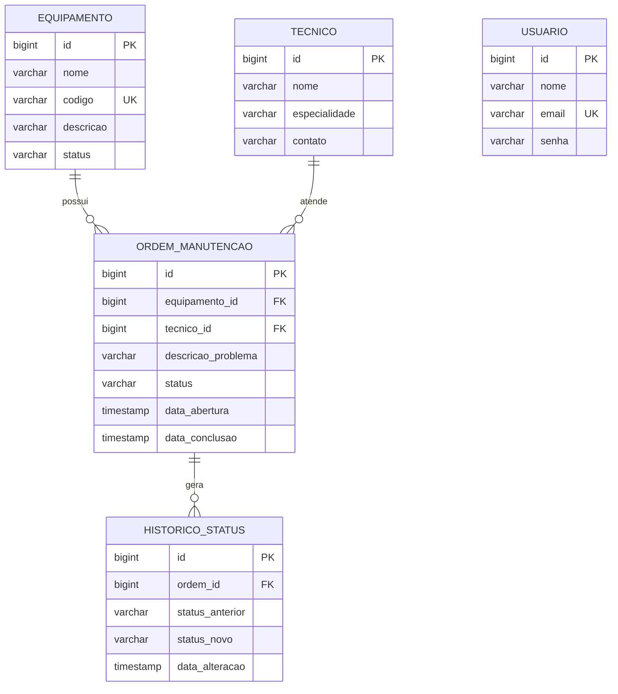

# Arquitetura — SGM (Sistema de Gestão de Manutenção de Equipamentos)

> Este documento complementa o `README.md` com detalhes técnicos de arquitetura, decisões de design e modelagem do banco de dados. Enquanto o README foca em "como rodar o projeto", este arquivo foca em "como o projeto foi construído e por quê".

---

## 📐 Visão Geral da Arquitetura

O back-end segue uma arquitetura em camadas (*layered architecture*), padrão comum em aplicações Spring Boot, separando responsabilidades de forma clara:

```
Requisição HTTP
      │
      ▼
┌─────────────┐
│  Controller  │  ← recebe a requisição, valida entrada (@Valid), devolve resposta HTTP
└─────────────┘
      │
      ▼
┌─────────────┐
│   Service    │  ← regras de negócio, orquestração, decisões
└─────────────┘
      │
      ▼
┌─────────────┐
│  Repository  │  ← acesso a dados (Spring Data JPA)
└─────────────┘
      │
      ▼
┌─────────────┐
│  PostgreSQL  │
└─────────────┘
```

**Por que essa separação?**
- **Controller** não conhece regras de negócio — só traduz HTTP ↔ Java.
- **Service** não conhece detalhes de banco de dados — só decide *o quê* fazer.
- **Repository** não conhece regras de negócio — só sabe *ler e escrever* dados.

Essa separação facilita testes (cada camada pode ser testada isoladamente com mocks) e manutenção (uma mudança de regra de negócio não deveria exigir alterar o Controller, por exemplo).

Camadas auxiliares, transversais a esse fluxo principal:

| Camada | Função |
|---|---|
| `model` | entidades JPA — representam as tabelas do banco |
| `dto` | objetos de transporte de dados (entrada/saída de requisições), desacoplados das entidades |
| `exception` | exceções customizadas + `GlobalExceptionHandler`, que padroniza respostas de erro |
| `security` | autenticação e autorização via Spring Security + JWT |
| `config` | configurações gerais (ex: Swagger/OpenAPI) |

---

## 🗂️ Estrutura de Pacotes

```
com.sgm.sgm/
├── model/          → Equipamento, Tecnico, OrdemManutencao, HistoricoStatus, Usuario, enums
├── repository/      → interfaces JpaRepository para cada entidade
├── service/          → lógica de negócio (EquipamentoService, TecnicoService, OrdemManutencaoService, AuthService)
├── controller/        → endpoints REST (@RestController)
├── dto/                → objetos de entrada/saída (NovaOrdemRequest, LoginRequest, ErroResponse, etc.)
├── exception/           → exceções customizadas e GlobalExceptionHandler
├── security/              → JwtUtil, JwtAuthenticationFilter, UsuarioDetailsService, SecurityConfig
└── config/                 → OpenApiConfig (Swagger)
```

---

## 🗄️ Modelagem do Banco de Dados (DER)

O banco possui 5 tabelas: `equipamento`, `tecnico`, `ordem_manutencao`, `historico_status` e `usuario`.



### Decisões de modelagem

- **`Equipamento.status` e `OrdemManutencao.status`** são armazenados como `varchar` com `@Enumerated(EnumType.STRING)`, em vez de índice numérico (`ORDINAL`). Isso evita um problema clássico: se a ordem dos valores do enum mudar no código no futuro, dados antigos no banco não ficam com o significado corrompido.
- **`codigo` do Equipamento** e **`email` do Usuário** têm constraint `unique` no banco, não só validação na aplicação — garante integridade mesmo em cenários de concorrência.
- **`HistoricoStatus` não tem relação inversa** (`OrdemManutencao` não carrega uma lista de históricos via `@OneToMany`). Decisão deliberada para manter a entidade principal enxuta; o histórico é consultado sob demanda via endpoint próprio (`GET /ordens/{id}/historico`).
- **`senha` do Usuário** nunca armazena texto puro — é sempre um hash gerado por `BCryptPasswordEncoder` antes da persistência.
- **`ddl-auto=update`** é usado apenas em desenvolvimento. Para produção, o recomendado é migrar para uma ferramenta de migrations (Flyway/Liquibase) ou `ddl-auto=validate`, evitando alterações automáticas de schema fora de controle.

---

## 🔐 Autenticação e Segurança

A API utiliza **Spring Security + JWT** (JSON Web Token) com sessão *stateless* — nenhum estado de login é guardado no servidor entre requisições.

### Fluxo de autenticação

```
1. Cliente envia POST /auth/login (email + senha)
2. AuthService valida credenciais via AuthenticationManager
   (que usa UsuarioDetailsService + BCryptPasswordEncoder por trás)
3. Se válido, JwtUtil gera um token assinado (HS256), válido por 24h
4. Cliente recebe o token e passa a enviá-lo em requisições futuras:
   Authorization: Bearer <token>
5. JwtAuthenticationFilter intercepta toda requisição, valida o token
   e autentica o usuário no contexto do Spring Security
6. Rotas protegidas (todas exceto /auth/** e Swagger) exigem token válido
```

### Por que JWT em vez de sessão tradicional?

- **Stateless**: o servidor não precisa guardar sessões em memória — facilita escalar horizontalmente no futuro (deploy com múltiplas instâncias).
- **Autocontido**: o próprio token carrega a informação de identidade (e-mail) e validade, sem consulta ao banco a cada requisição para checar sessão.
- **Padrão de mercado** para APIs REST consumidas por front-ends desacoplados, como é o caso deste projeto (`frontend.md`).

### Rotas públicas vs protegidas

| Rota | Acesso |
|---|---|
| `POST /auth/login`, `POST /auth/cadastro` | Público |
| `/swagger-ui/**`, `/v3/api-docs/**` | Público |
| Todas as demais (`/equipamentos`, `/tecnicos`, `/ordens`) | Requer token JWT válido |

---

## ⚠️ Tratamento de Erros

Centralizado via `@RestControllerAdvice` (`GlobalExceptionHandler`), evitando tratamento repetido em cada Controller. Toda exceção lançada pelas camadas de Service é convertida em uma resposta JSON padronizada:

```json
{
  "timestamp": "2026-08-31T23:15:00",
  "status": 404,
  "erro": "Recurso não encontrado",
  "mensagem": "Equipamento não encontrado"
}
```

| Exceção | HTTP Status | Quando ocorre |
|---|---|---|
| `RecursoNaoEncontradoException` | `404 Not Found` | Busca por ID/e-mail que não existe |
| `RegraNegocioException` | `409 Conflict` | Violação de regra de negócio (ex: ordem duplicada, e-mail já cadastrado) |
| `MethodArgumentNotValidException` | `400 Bad Request` | Falha de validação de campos (`@NotBlank`, etc.) |
| `Exception` (genérica) | `500 Internal Server Error` | Qualquer erro não previsto |

---

## 🔄 Regras de Negócio Implementadas

1. **Bloqueio de ordem duplicada**: não é possível abrir uma nova Ordem de Manutenção para um Equipamento que já possua uma ordem com status `ABERTA`.
2. **Fluxo de status da Ordem**: `ABERTA → EM_ANDAMENTO → CONCLUIDA`, atualizado via `PATCH /ordens/{id}/status`.
3. **Histórico automático**: toda transição de status gera um registro em `HistoricoStatus`, incluindo a abertura inicial da ordem (`statusAnterior = null`).
4. **Data de conclusão automática**: `dataConclusao` é preenchida automaticamente quando o status muda para `CONCLUIDA`, sem exigir esse dado do cliente.

---

## 🛠️ Stack Tecnológica

| Camada | Tecnologia |
|---|---|
| Linguagem | Java 17 |
| Framework | Spring Boot 4.1.1 |
| Persistência | Spring Data JPA + Hibernate |
| Banco de dados | PostgreSQL |
| Autenticação | Spring Security + JWT (JJWT 0.12.6) |
| Documentação de API | springdoc-openapi (Swagger UI) |
| Validação | Jakarta Validation (Bean Validation) |
| Build | Maven |
| Front-end | HTML, CSS, JavaScript puro (sem framework) |

---

## 📌 Decisões de Design — Resumo

| Decisão | Alternativa considerada | Por que essa escolha |
|---|---|---|
| Arquitetura em camadas (Controller/Service/Repository) | Tudo no Controller | Separação de responsabilidades, testabilidade |
| DTOs para entrada/saída de dados sensíveis | Expor entidades JPA diretamente | Evita vazar estrutura interna do banco e permite formatos de entrada diferentes do modelo (ex: `NovaOrdemRequest` recebe IDs, não objetos completos) |
| JWT stateless | Sessão + cookie | API REST desacoplada de um front-end específico; facilita escalabilidade futura |
| Exceções customizadas + handler global | `try/catch` em cada Controller | Elimina repetição, centraliza formato de erro |
| `@Enumerated(EnumType.STRING)` | `EnumType.ORDINAL` | Segurança contra mudanças futuras na ordem dos valores do enum |